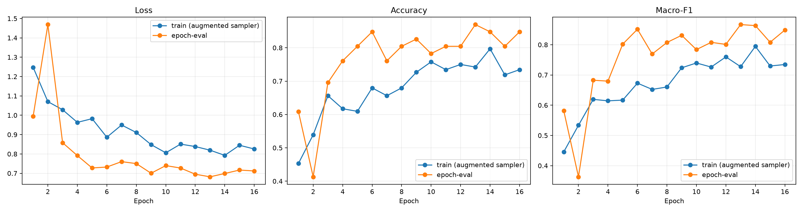

# X3D-M 工业视频扩充数据四分类实验审计报告

- 审计日期：2026-09-01
- 任务类别：`normal`、`board_drop`、`single_hand`、`touch_face`
- 输入方案：全图 X3D-M 与固定工位 ROI X3D-M
- 数据根目录：`data/industrial_anomaly`（示例路径，数据不随仓库发布）
- 标注根目录：`data/annotations`（示例路径，标注不随仓库发布）

## 1. 审计范围与实验设置

本轮共使用 135 个源视频，采用源视频级四折交叉验证。任何源视频及其所有事件段、困难正常窗口只会出现在同一折的同一个数据分割中，训练集、验证集、测试集之间不存在源视频交叉。`no_gloves` 不参与本轮四分类。

`single_hand+board_drop` 目录中的 25 个视频不是第五类，而是多动作源视频。程序按 JSON 中的动作区间拆成 54 个事件样本，其中 `board_drop` 25 段、`single_hand` 29 段；每段严格使用自己的 JSON 起止时间采样 16 帧，避免固定 2.67 秒窗口跨入相邻的另一类动作。

完整折外测试清单共 237 个窗口：

| 类别 | 窗口数 |
|---|---:|
| normal | 66（37 个独立正常窗口 + 29 个困难正常窗口） |
| board_drop | 33 |
| single_hand | 81 |
| touch_face | 57 |

共同训练设置：官方 Kinetics-400 预训练 X3D-M；每个输入16帧、224×224；batch size 2、梯度累积2；每 epoch 类别平衡抽样128个窗口；分类头训练6个 epoch，随后微调最后两个模块最多10个 epoch；以验证集 Macro-F1 选择最佳权重并使用 early stopping。ROI 方案对每条视频使用固定归一化矩形框，扩展8%，越界部分复制邻近真实像素，再缩放至224×224。

### 指标口径说明

训练集和验证集逐类指标是本次审计使用每折验证 Macro-F1 选出的 `best.pt` 重新推理得到的。审计推理关闭随机空间增强、时间抖动、正常视频随机时间采样和带放回类别平衡采样，每个清单窗口只推理一次。四折合并时，每个样本进入验证集和测试集各一次、进入训练集两次，因此训练集 support 恰为测试集的两倍。这里的逐类“准确率”按标准多分类口径等于该类 Recall。

## 2. 总体结果与分析

### 2.1 折外测试总体结果

| 指标 | 全图 | ROI |
|---|---:|---:|
| 窗口准确率 | **82.70%** | 77.22% |
| 窗口 Macro-F1 | **0.825** | 0.769 |
| 平衡准确率 | **82.29%** | 77.84% |
| 四折平均测试准确率 | **82.68% ± 3.51%** | 77.18% ± 2.80% |
| 四折平均测试 Macro-F1 | **0.820 ± 0.041** | 0.766 ± 0.031 |
| 源视频-类别聚合准确率 | **80.62%** | 74.38% |
| 源视频-类别聚合 Macro-F1 | **0.819** | 0.762 |

全图是本轮总体最优方案：窗口准确率比 ROI 高 5.48 个百分点，Macro-F1 高约 0.056。ROI 的主要收益是困难正常窗口识别，但明显损失了 `single_hand` 所需的人体姿态、另一只手位置和板子运动轨迹等全局上下文，因此不适合直接取代全图。

汇总文件中的 `oof_source_count=160` 是“源视频-类别组合”数量，不是物理视频数量。真实物理源视频为135个；25个混合动作视频分别为 `board_drop` 和 `single_hand` 聚合，因此产生160个源视频-类别组合。

### 2.2 各类别折外测试结果

| 类别 | 全图 Precision | 全图 Recall/类准确率 | 全图 F1 | ROI Precision | ROI Recall/类准确率 | ROI F1 |
|---|---:|---:|---:|---:|---:|---:|
| normal | 78.33% | 71.21% | 0.746 | 72.06% | 74.24% | 0.731 |
| board_drop | 78.12% | 75.76% | 0.769 | 63.16% | 72.73% | 0.676 |
| single_hand | 78.16% | 83.95% | 0.810 | 76.39% | 67.90% | 0.719 |
| touch_face | 96.55% | 98.25% | 0.974 | 93.22% | 96.49% | 0.948 |

扩充数据最显著地修复了 `single_hand`：全图 F1 从旧实验的0.182提高到0.810，ROI从0.286提高到0.719。`touch_face` 仍然最稳定。纯 ROI 对 `single_hand` 的 Recall 只有67.90%，显著低于全图83.95%。

混合视频事件段中，全图对 `board_drop` 识别21/25（84%），对 `single_hand` 识别24/29（82.76%）；ROI分别为21/25（84%）和22/29（75.86%）。但原 `board_drop` 文件夹的8个事件仅识别4/8（全图）和3/8（ROI），提示新旧掉板视频可能存在角度、动作形式或背景差异。

### 2.3 混淆矩阵

**全图（行是真实类别，列是预测类别）**

| 真实类别 | normal | board_drop | single_hand | touch_face |
|---|---:|---:|---:|---:|
| normal | 47 | 2 | 15 | 2 |
| board_drop | 4 | 25 | 4 | 0 |
| single_hand | 9 | 4 | 68 | 0 |
| touch_face | 0 | 1 | 0 | 56 |

**ROI（行是真实类别，列是预测类别）**

| 真实类别 | normal | board_drop | single_hand | touch_face |
|---|---:|---:|---:|---:|
| normal | 49 | 3 | 10 | 4 |
| board_drop | 3 | 24 | 6 | 0 |
| single_hand | 16 | 10 | 55 | 0 |
| touch_face | 0 | 1 | 1 | 55 |

主要混淆是正常动作与 `single_hand` 之间，以及 ROI 下 `single_hand` 与 `board_drop` 之间。全图将15个正常窗口判为 `single_hand`；ROI将16个 `single_hand` 窗口判为正常、10个判为 `board_drop`。

### 2.4 正常/异常报警口径

| 指标 | 全图 | ROI |
|---|---:|---:|
| 正常召回率 | 71.21% | 74.24% |
| 正常窗口误报率 | 28.79% | 25.76% |
| 异常召回率 | 92.40% | 88.89% |
| 报警精确率 | 89.27% | 89.94% |

困难正常窗口正常召回率：全图 75.86%（22/29），ROI 82.76%（24/29）。独立正常视频中心窗口两者均为25/37（67.57%）。当前正常窗口仍有约四分之一到三分之一触发报警，不能直接用于现场报警。

### 2.5 与扩充前四分类实验对比

| 实验 | 原窗口准确率 | 扩充后 | 原 Macro-F1 | 扩充后 |
|---|---:|---:|---:|---:|
| 全图 | 66.10% | **82.70%** | 0.581 | **0.825** |
| ROI | 71.19% | **77.22%** | 0.590 | **0.769** |

全图四折准确率标准差由16.32%降至3.51%，ROI由8.07%降至2.80%，说明扩充后结果明显更稳定。新旧实验测试集规模和类别分布不同，因此提升不能解释为严格配对的统计增益，但数据扩充的正向作用明确。

## 3. 全图：训练集、验证集、测试集指标

### 总体指标

| 数据分割 | 样本计数 | Accuracy | Balanced Accuracy | Macro-F1 |
|---|---:|---:|---:|---:|
| 训练集 | 474 | 89.45% | 89.22% | 0.890 |
| 验证集 | 237 | 84.39% | 83.70% | 0.835 |
| 测试集（OOF） | 237 | 82.70% | 82.29% | 0.825 |

### 各类别指标

| 类别 | Train P | Train Recall/Acc | Train F1 | Train N | Val P | Val Recall/Acc | Val F1 | Val N | Test P | Test Recall/Acc | Test F1 | Test N |
|---|---:|---:|---:|---:|---:|---:|---:|---:|---:|---:|---:|---:|
| normal | 85.19% | 87.12% | 0.861 | 132 | 78.26% | 81.82% | 0.800 | 66 | 78.33% | 71.21% | 0.746 | 66 |
| board_drop | 83.33% | 83.33% | 0.833 | 66 | 72.73% | 72.73% | 0.727 | 33 | 78.12% | 75.76% | 0.769 | 33 |
| single_hand | 90.91% | 86.42% | 0.886 | 162 | 85.53% | 80.25% | 0.828 | 81 | 78.16% | 83.95% | 0.810 | 81 |
| touch_face | 95.80% | 100.00% | 0.979 | 114 | 96.61% | 100.00% | 0.983 | 57 | 96.55% | 98.25% | 0.974 | 57 |

## 4. ROI：训练集、验证集、测试集指标

### 总体指标

| 数据分割 | 样本计数 | Accuracy | Balanced Accuracy | Macro-F1 |
|---|---:|---:|---:|---:|
| 训练集 | 474 | 93.46% | 94.82% | 0.933 |
| 验证集 | 237 | 79.32% | 79.52% | 0.793 |
| 测试集（OOF） | 237 | 77.22% | 77.84% | 0.769 |

### 各类别指标

| 类别 | Train P | Train Recall/Acc | Train F1 | Train N | Val P | Val Recall/Acc | Val F1 | Val N | Test P | Test Recall/Acc | Test F1 | Test N |
|---|---:|---:|---:|---:|---:|---:|---:|---:|---:|---:|---:|---:|
| normal | 91.37% | 96.21% | 0.937 | 132 | 68.92% | 77.27% | 0.729 | 66 | 72.06% | 74.24% | 0.731 | 66 |
| board_drop | 81.25% | 98.48% | 0.890 | 66 | 72.73% | 72.73% | 0.727 | 33 | 63.16% | 72.73% | 0.676 | 33 |
| single_hand | 97.86% | 84.57% | 0.907 | 162 | 80.56% | 71.60% | 0.758 | 81 | 76.39% | 67.90% | 0.719 | 81 |
| touch_face | 99.13% | 100.00% | 0.996 | 114 | 94.83% | 96.49% | 0.957 | 57 | 93.22% | 96.49% | 0.948 | 57 |

全图从确定性训练集到折外测试集的 Accuracy 差距为6.75个百分点、Macro-F1差距为0.065；ROI对应差距达到16.24个百分点和0.164。ROI训练集指标虽然更高，但验证集和测试集反而更低，显示纯ROI方案存在更明显的过拟合或跨视频泛化不足。这也是当前应选择全图作为主分支、而不是依据训练集准确率选择ROI的直接证据。

## 5. 折外测试中未正确识别的视频/事件

定义：以下清单只使用四折 OOF 测试预测；某源视频在某真实类别下至少有一个测试窗口预测错误即列出。`错误窗口/该视频该类总窗口` 可区分“部分事件错误”和“全部事件错误”。对于 `normal`，列表同时可能包含独立正常视频与异常视频中的困难正常窗口。视频相对路径均相对于工业视频数据根目录。

### 5.1 全图模型错误视频

#### normal（17个源视频）

| 视频 | 错误窗口/该类总窗口 | 错误预测 | 错误窗口及来源 |
|---|---:|---|---|
| `board_drop/14.mp4` | 1/3 | touch_face×1 | 0.000–2.667s（困难正常）→ touch_face |
| `board_drop/19.mp4` | 2/2 | single_hand×2 | 0.000–2.667s（困难正常）→ single_hand 0.208–2.875s（困难正常）→ single_hand |
| `board_drop/21.mp4` | 1/2 | single_hand×1 | 1.291–3.958s（困难正常）→ single_hand |
| `normal/32.mp4` | 1/1 | touch_face×1 | 0.000–0.875s（独立正常）→ touch_face |
| `normal/33.mp4` | 1/1 | single_hand×1 | 1.021–3.688s（独立正常）→ single_hand |
| `normal/37.mp4` | 1/1 | single_hand×1 | 13.055–15.722s（独立正常）→ single_hand |
| `normal/58.mp4` | 1/1 | single_hand×1 | 1.554–4.221s（独立正常）→ single_hand |
| `normal/61.mp4` | 1/1 | single_hand×1 | 0.881–3.547s（独立正常）→ single_hand |
| `normal/62.mp4` | 1/1 | single_hand×1 | 0.812–3.478s（独立正常）→ single_hand |
| `normal/71.mp4` | 1/1 | single_hand×1 | 1.880–4.547s（独立正常）→ single_hand |
| `normal/78.mp4` | 1/1 | single_hand×1 | 0.966–3.633s（独立正常）→ single_hand |
| `normal/83.mp4` | 1/1 | single_hand×1 | 1.373–4.039s（独立正常）→ single_hand |
| `normal/85.mp4` | 1/1 | single_hand×1 | 1.749–4.416s（独立正常）→ single_hand |
| `normal/87.mp4` | 1/1 | single_hand×1 | 1.993–4.659s（独立正常）→ single_hand |
| `normal/89.mp4` | 1/1 | single_hand×1 | 1.553–4.219s（独立正常）→ single_hand |
| `single_hand/65.mp4` | 1/2 | single_hand×1 | 2.000–4.667s（困难正常）→ single_hand |
| `single_hand+board_drop/115.mp4` | 2/2 | board_drop×2 | 1.967–4.634s（困难正常）→ board_drop 2.278–4.944s（困难正常）→ board_drop |

#### board_drop（8个源视频）

| 视频 | 错误窗口/该类总窗口 | 错误预测 | 错误窗口及来源 |
|---|---:|---|---|
| `board_drop/14.mp4` | 1/1 | normal×1 | 6.598–9.265s（中心窗口）→ normal |
| `board_drop/15.mp4` | 1/1 | normal×1 | 2.619–5.286s（中心窗口）→ normal |
| `board_drop/17.mp4` | 1/1 | normal×1 | 3.500–6.167s（中心窗口）→ normal |
| `board_drop/19.mp4` | 1/1 | single_hand×1 | 3.188–5.854s（中心窗口）→ single_hand |
| `single_hand+board_drop/50.mp4` | 1/1 | single_hand×1 | 3.399–4.699s（JSON事件段）→ single_hand |
| `single_hand+board_drop/52.mp4` | 1/1 | single_hand×1 | 5.666–7.299s（JSON事件段）→ single_hand |
| `single_hand+board_drop/54.mp4` | 1/1 | single_hand×1 | 1.933–2.899s（JSON事件段）→ single_hand |
| `single_hand+board_drop/124.mp4` | 1/1 | normal×1 | 0.900–1.333s（JSON事件段）→ normal |

#### single_hand（12个源视频）

| 视频 | 错误窗口/该类总窗口 | 错误预测 | 错误窗口及来源 |
|---|---:|---|---|
| `single_hand/10.mp4` | 1/1 | normal×1 | 6.865–9.531s（中心窗口）→ normal |
| `single_hand/11.mp4` | 1/1 | normal×1 | 6.498–9.164s（中心窗口）→ normal |
| `single_hand/12.mp4` | 1/1 | normal×1 | 7.524–10.190s（中心窗口）→ normal |
| `single_hand/44.mp4` | 1/1 | normal×1 | 0.033–2.700s（中心窗口）→ normal |
| `single_hand/48.mp4` | 1/1 | normal×1 | 0.000–2.667s（中心窗口）→ normal |
| `single_hand/63.mp4` | 1/1 | normal×1 | 4.061–6.728s（中心窗口）→ normal |
| `single_hand/66.mp4` | 1/1 | normal×1 | 2.500–5.166s（中心窗口）→ normal |
| `single_hand/95.mp4` | 1/2 | normal×1 | 1.516–4.183s（中心窗口）→ normal |
| `single_hand+board_drop/55.mp4` | 1/1 | normal×1 | 1.067–1.800s（JSON事件段）→ normal |
| `single_hand+board_drop/112.mp4` | 1/1 | board_drop×1 | 0.033–2.133s（JSON事件段）→ board_drop |
| `single_hand+board_drop/114.mp4` | 2/2 | board_drop×2 | 0.000–0.233s（JSON事件段）→ board_drop 3.699–4.199s（JSON事件段）→ board_drop |
| `single_hand+board_drop/115.mp4` | 1/1 | board_drop×1 | 0.000–0.567s（JSON事件段）→ board_drop |

#### touch_face（1个源视频）

| 视频 | 错误窗口/该类总窗口 | 错误预测 | 错误窗口及来源 |
|---|---:|---|---|
| `touch_face/34.mp4` | 1/2 | board_drop×1 | 5.397–8.064s（中心窗口）→ board_drop |

### 5.2 ROI模型错误视频

#### normal（16个源视频）

| 视频 | 错误窗口/该类总窗口 | 错误预测 | 错误窗口及来源 |
|---|---:|---|---|
| `board_drop/18.mp4` | 1/2 | board_drop×1 | 0.208–2.875s（困难正常）→ board_drop |
| `board_drop/19.mp4` | 2/2 | touch_face×2 | 0.000–2.667s（困难正常）→ touch_face 0.208–2.875s（困难正常）→ touch_face |
| `board_drop/20.mp4` | 1/2 | board_drop×1 | 0.000–2.667s（困难正常）→ board_drop |
| `board_drop/21.mp4` | 1/2 | board_drop×1 | 0.000–2.667s（困难正常）→ board_drop |
| `normal/32.mp4` | 1/1 | touch_face×1 | 0.000–0.875s（独立正常）→ touch_face |
| `normal/33.mp4` | 1/1 | touch_face×1 | 1.021–3.688s（独立正常）→ touch_face |
| `normal/38.mp4` | 1/1 | single_hand×1 | 4.053–6.719s（独立正常）→ single_hand |
| `normal/57.mp4` | 1/1 | single_hand×1 | 0.400–3.067s（独立正常）→ single_hand |
| `normal/61.mp4` | 1/1 | single_hand×1 | 0.881–3.547s（独立正常）→ single_hand |
| `normal/78.mp4` | 1/1 | single_hand×1 | 0.966–3.633s（独立正常）→ single_hand |
| `normal/83.mp4` | 1/1 | single_hand×1 | 1.373–4.039s（独立正常）→ single_hand |
| `normal/85.mp4` | 1/1 | single_hand×1 | 1.749–4.416s（独立正常）→ single_hand |
| `normal/86.mp4` | 1/1 | single_hand×1 | 1.728–4.394s（独立正常）→ single_hand |
| `normal/88.mp4` | 1/1 | single_hand×1 | 1.612–4.279s（独立正常）→ single_hand |
| `normal/89.mp4` | 1/1 | single_hand×1 | 1.553–4.219s（独立正常）→ single_hand |
| `normal/90.mp4` | 1/1 | single_hand×1 | 1.518–4.184s（独立正常）→ single_hand |

#### board_drop（9个源视频）

| 视频 | 错误窗口/该类总窗口 | 错误预测 | 错误窗口及来源 |
|---|---:|---|---|
| `board_drop/14.mp4` | 1/1 | normal×1 | 6.598–9.265s（中心窗口）→ normal |
| `board_drop/15.mp4` | 1/1 | normal×1 | 2.619–5.286s（中心窗口）→ normal |
| `board_drop/16.mp4` | 1/1 | single_hand×1 | 1.562–4.229s（中心窗口）→ single_hand |
| `board_drop/17.mp4` | 1/1 | normal×1 | 3.500–6.167s（中心窗口）→ normal |
| `board_drop/19.mp4` | 1/1 | single_hand×1 | 3.188–5.854s（中心窗口）→ single_hand |
| `single_hand+board_drop/52.mp4` | 1/1 | single_hand×1 | 5.666–7.299s（JSON事件段）→ single_hand |
| `single_hand+board_drop/56.mp4` | 1/1 | single_hand×1 | 2.799–4.266s（JSON事件段）→ single_hand |
| `single_hand+board_drop/122.mp4` | 1/1 | single_hand×1 | 1.500–2.866s（JSON事件段）→ single_hand |
| `single_hand+board_drop/124.mp4` | 1/1 | single_hand×1 | 0.900–1.333s（JSON事件段）→ single_hand |

#### single_hand（21个源视频）

| 视频 | 错误窗口/该类总窗口 | 错误预测 | 错误窗口及来源 |
|---|---:|---|---|
| `single_hand/10.mp4` | 1/1 | board_drop×1 | 6.865–9.531s（中心窗口）→ board_drop |
| `single_hand/11.mp4` | 1/1 | normal×1 | 6.498–9.164s（中心窗口）→ normal |
| `single_hand/12.mp4` | 1/1 | normal×1 | 7.524–10.190s（中心窗口）→ normal |
| `single_hand/13.mp4` | 1/1 | normal×1 | 6.011–8.677s（中心窗口）→ normal |
| `single_hand/44.mp4` | 1/1 | board_drop×1 | 0.033–2.700s（中心窗口）→ board_drop |
| `single_hand/49.mp4` | 1/1 | normal×1 | 0.150–2.816s（中心窗口）→ normal |
| `single_hand/63.mp4` | 1/1 | board_drop×1 | 4.061–6.728s（中心窗口）→ board_drop |
| `single_hand/64.mp4` | 1/1 | normal×1 | 2.000–4.666s（中心窗口）→ normal |
| `single_hand/65.mp4` | 1/1 | normal×1 | 0.000–2.667s（中心窗口）→ normal |
| `single_hand/66.mp4` | 1/1 | normal×1 | 2.500–5.166s（中心窗口）→ normal |
| `single_hand/95.mp4` | 2/2 | normal×2 | 0.000–2.667s（中心窗口）→ normal 1.516–4.183s（中心窗口）→ normal |
| `single_hand/96.mp4` | 2/2 | normal×2 | 0.000–2.667s（中心窗口）→ normal 2.083–4.750s（中心窗口）→ normal |
| `single_hand/97.mp4` | 2/2 | normal×2 | 0.000–2.667s（中心窗口）→ normal 1.983–4.649s（中心窗口）→ normal |
| `single_hand/98.mp4` | 1/2 | board_drop×1 | 1.633–4.300s（中心窗口）→ board_drop |
| `single_hand/102.mp4` | 2/2 | normal×2 | 0.000–2.667s（中心窗口）→ normal 2.150–4.816s（中心窗口）→ normal |
| `single_hand+board_drop/108.mp4` | 2/3 | board_drop×2 | 0.000–2.033s（JSON事件段）→ board_drop 2.233–3.133s（JSON事件段）→ board_drop |
| `single_hand+board_drop/112.mp4` | 1/1 | board_drop×1 | 0.033–2.133s（JSON事件段）→ board_drop |
| `single_hand+board_drop/114.mp4` | 1/2 | normal×1 | 3.699–4.199s（JSON事件段）→ normal |
| `single_hand+board_drop/120.mp4` | 1/1 | board_drop×1 | 0.533–1.766s（JSON事件段）→ board_drop |
| `single_hand+board_drop/121.mp4` | 1/1 | board_drop×1 | 0.900–2.433s（JSON事件段）→ board_drop |
| `single_hand+board_drop/124.mp4` | 1/1 | board_drop×1 | 0.000–0.833s（JSON事件段）→ board_drop |

#### touch_face（2个源视频）

| 视频 | 错误窗口/该类总窗口 | 错误预测 | 错误窗口及来源 |
|---|---:|---|---|
| `touch_face/34.mp4` | 1/2 | board_drop×1 | 5.397–8.064s（中心窗口）→ board_drop |
| `touch_face/139.mp4` | 1/3 | single_hand×1 | 0.900–3.566s（中心窗口）→ single_hand |

## 6. 全图80/20留出实验：固定16轮后测试

### 6.1 实验设置与指标角色

本实验沿用相同数据处理方法和随机种子2026，按源视频组分层划分为108个训练源视频和27个测试源视频，源视频比例严格为80%/20%，源视频交集为0。对应训练窗口191个、测试窗口46个。训练阶段不设置验证集，不进行早停，也不使用测试指标选择模型；固定执行分类头6轮和末两模块微调10轮，最后只评估第16轮模型。

因此本节指标角色是：训练集有指标，验证集不存在，测试集为一次性测试。测试窗口类别分布为 `normal=11`、`board_drop=7`、`single_hand=17`、`touch_face=11`。

### 6.2 总体训练集、验证集、测试集指标

| 数据分割 | 样本数 | Accuracy | Balanced Accuracy | Macro-F1 | 说明 |
|---|---:|---:|---:|---:|---|
| 训练集 | 191 | 87.96% | 88.98% | 0.873 | 第16轮权重、关闭增强后的确定性推理 |
| 验证集 | — | — | — | — | 本实验未设置验证集 |
| 测试集 | 46 | 82.61% | 85.33% | 0.824 | 第16轮结束后仅测试一次 |

训练集与测试集的 Accuracy 相差5.35个百分点，Macro-F1相差0.049，未表现出特别严重的整体过拟合。训练及最终评估共耗时约84.3分钟。

### 6.3 各类别训练集、验证集、测试集指标

逐类“准确率”按多分类标准口径等于该类 Recall。

| 类别 | Train P | Train Recall/Acc | Train F1 | Train N | Val P | Val Recall/Acc | Val F1 | Val N | Test P | Test Recall/Acc | Test F1 | Test N |
|---|---:|---:|---:|---:|---:|---:|---:|---:|---:|---:|---:|---:|
| normal | 81.97% | 90.91% | 0.862 | 55 | — | — | — | — | 76.92% | 90.91% | 0.833 | 11 |
| board_drop | 71.88% | 88.46% | 0.793 | 26 | — | — | — | — | 60.00% | 85.71% | 0.706 | 7 |
| single_hand | 98.00% | 76.56% | 0.860 | 64 | — | — | — | — | 91.67% | 64.71% | 0.759 | 17 |
| touch_face | 95.83% | 100.00% | 0.979 | 46 | — | — | — | — | 100.00% | 100.00% | 1.000 | 11 |

### 6.4 混淆、报警指标与错误样本

| 真实类别 | normal | board_drop | single_hand | touch_face |
|---|---:|---:|---:|---:|
| normal | 10 | 1 | 0 | 0 |
| board_drop | 0 | 6 | 1 | 0 |
| single_hand | 3 | 3 | 11 | 0 |
| touch_face | 0 | 0 | 0 | 11 |

46个测试窗口中正确38个、错误8个。错误主要集中在 `single_hand`：3个被判为正常、3个被判为 `board_drop`。困难正常窗口4/4正确，独立正常窗口6/7正确。按正常/异常二分类计算，正常召回率90.91%、正常窗口误报率9.09%、异常召回率91.43%、报警精确率96.97%。但正常测试窗口只有11个，错1个就改变9.09个百分点，不能据此认定现场误报率已经稳定降至9.09%。

错误窗口如下：

| 真实类别 | 视频/事件 | 错误预测 | 置信度 |
|---|---|---|---:|
| normal | `normal/36` | board_drop | 0.49 |
| board_drop | `single_hand+board_drop/50` | single_hand | 0.46 |
| single_hand | `single_hand+board_drop/119` | board_drop | 0.48 |
| single_hand | `single_hand+board_drop/120` | board_drop | 0.42 |
| single_hand | `single_hand/103` | normal | 0.39 |
| single_hand | `single_hand/13` | normal | 0.50 |
| single_hand | `single_hand/44` | normal | 0.52 |
| single_hand | `single_hand/93` | board_drop | 0.46 |

### 6.5 与四折全图结果对比

| 指标 | 四折全图 OOF | 80/20一次性测试 |
|---|---:|---:|
| Accuracy | 82.70% | 82.61% |
| Macro-F1 | 0.825 | 0.824 |
| Balanced Accuracy | 82.29% | 85.33% |
| normal Recall | 71.21% | 90.91% |
| board_drop Recall | 75.76% | 85.71% |
| single_hand Recall | 83.95% | 64.71% |
| touch_face Recall | 98.25% | 100.00% |

总体指标几乎相同，说明模型整体性能约在82%–83%附近；但单类指标波动很大，反映出46个测试窗口的单次留出结果对样本构成较敏感。因此科学结论仍以四折交叉验证为主，80/20结果作为独立确认。

## 7. 全图80/20逐轮评估实验：选择最佳停止时机

### 7.1 实验设置与统计限制

本实验与第6节使用完全相同的108/27源视频和191/46窗口划分，划分差异数为0。区别是每个 epoch 结束后都在20%数据上评估 Loss、Accuracy和Macro-F1，并按“Macro-F1优先、Accuracy其次、Loss再次”保存最佳权重。

由于20%数据被反复查看并用于选择最佳 epoch，它在统计意义上已经成为验证集/开发集，而不是完全独立测试集。因此本节指标角色是：训练集有指标，验证集为46个 `epoch-eval` 窗口，独立测试集不存在。第13轮结果适合工程选型，但不能作为无偏最终测试成绩。

### 7.2 最佳停止时机与曲线分析

| 指标 | 第13轮（最佳） | 第16轮（最后） |
|---|---:|---:|
| Eval Accuracy | **86.96%** | 84.78% |
| Eval Balanced Accuracy | 89.08% | **89.71%** |
| Eval Macro-F1 | **0.867** | 0.849 |
| Eval Loss | **0.682** | 0.712 |
| 错误窗口 | **6/46** | 7/46 |

工程上应选择第13轮而不是第16轮。第1–6轮只训练分类头，评估Macro-F1逐步提高到约0.85；第7轮解冻末端模块后出现短暂下降；第8–9轮恢复；第13轮同时取得最低评估Loss、最高Accuracy和最高Macro-F1。第14轮训练指标继续上升而评估指标下降，第15轮下降更明显，第16轮虽有所恢复但没有超过第13轮，说明第13轮之后出现轻微过拟合或类别边界偏移。

同一次训练内，第13轮相对第16轮使Accuracy提高2.18个百分点、Macro-F1提高0.018，并少错1个窗口。相较上一轮独立训练的第16轮，第13轮高4.35个百分点、Macro-F1高0.043；但这部分差异同时包含随机训练波动和逐轮选模收益，不能全部归因于早停。

训练曲线中的训练值来自带随机增强、随机正常时间和类别平衡抽样的即时指标，因此比无增强的 `epoch-eval` 更抖动，二者不能逐点解释为传统意义上的训练/验证差距。使用第13轮权重关闭增强后重新推理，确定性训练Accuracy为88.48%、Macro-F1为0.881，与 `epoch-eval` 的Accuracy 86.96%、Macro-F1 0.867差距较小。

### 7.3 各类别训练集、验证集、测试集指标（第13轮）

| 类别 | Train P | Train Recall/Acc | Train F1 | Train N | Val/Eval P | Val/Eval Recall/Acc | Val/Eval F1 | Val/Eval N | 独立Test P | 独立Test Recall/Acc | 独立Test F1 | 独立Test N |
|---|---:|---:|---:|---:|---:|---:|---:|---:|---:|---:|---:|---:|
| normal | 88.68% | 85.45% | 0.870 | 55 | 84.62% | 100.00% | 0.917 | 11 | — | — | — | — |
| board_drop | 71.43% | 96.15% | 0.820 | 26 | 66.67% | 85.71% | 0.750 | 7 | — | — | — | — |
| single_hand | 92.73% | 79.69% | 0.857 | 64 | 92.31% | 70.59% | 0.800 | 17 | — | — | — | — |
| touch_face | 95.83% | 100.00% | 0.979 | 46 | 100.00% | 100.00% | 1.000 | 11 | — | — | — | — |

总体指标：

| 数据分割 | 样本数 | Accuracy | Balanced Accuracy | Macro-F1 |
|---|---:|---:|---:|---:|
| 训练集（第13轮、确定性） | 191 | 88.48% | 90.32% | 0.881 |
| 验证/epoch-eval（第13轮） | 46 | 86.96% | 89.08% | 0.867 |
| 独立测试集 | — | — | — | — |

### 7.4 第13轮混淆、报警指标与错误样本

| 真实类别 | normal | board_drop | single_hand | touch_face |
|---|---:|---:|---:|---:|
| normal | 11 | 0 | 0 | 0 |
| board_drop | 0 | 6 | 1 | 0 |
| single_hand | 2 | 3 | 12 | 0 |
| touch_face | 0 | 0 | 0 | 11 |

按正常/异常二分类计算，正常召回率100%、窗口误报率0%、异常召回率94.29%、报警精确率100%。这些数字来自仅11个正常验证窗口，不能直接外推现场误报率。

第13轮共错误6个窗口：

| 真实类别 | 视频/事件 | 错误预测 | 置信度 |
|---|---|---|---:|
| board_drop | `single_hand+board_drop/50` | single_hand | 0.54 |
| single_hand | `single_hand+board_drop/119` | board_drop | 0.41 |
| single_hand | `single_hand+board_drop/120` | board_drop | 0.54 |
| single_hand | `single_hand+board_drop/123` | board_drop | 0.59 |
| single_hand | `single_hand/103` | normal | 0.45 |
| single_hand | `single_hand/13` | normal | 0.37 |

普通 `single_hand` 识别10/12（83.33%），混合视频中的 `single_hand` 仅识别2/5（40%），混合视频中的 `board_drop` 识别4/5（80%）。当前最明确的短板是同一源视频同时存在单手与掉板时，模型容易把单手片段判断为掉板。

### 7.5 工程训练建议

当前工程候选权重为第13轮 `best_epoch_eval.pt`。后续同类训练建议先固定完成6轮分类头训练，微调阶段至少运行到全局第12–13轮，随后以Macro-F1为主指标保存最佳权重。若要自动早停，不能在微调刚开始的第7–8轮立即停止，因为阶段切换会短暂下降；可设置微调最少7轮后再启用连续2轮无提升停止。

## 8. 审计结论与后续建议

1. 扩充数据显著提高了四分类能力和跨折稳定性，尤其修复了 `single_hand` 类别；这证明继续增加独立源视频比单纯增加同一视频相邻窗口更有效。
2. 全图是当前最佳单分支模型。纯 ROI 虽能改善部分困难正常窗口，但会丢失 `single_hand` 与掉板判断所需的全局关系。建议下一轮采用全图主分支 + ROI 辅助分支，并学习动态融合权重。
3. 应优先回看本报告列出的旧 `board_drop` 错误视频以及被判为 `single_hand` 的正常视频，判断是否存在视角域差异、ROI框遗漏、标签边界不准或正常动作与单手动作视觉相似。
4. 当前测试仍是标注事件窗口和困难正常窗口，不是完整视频连续滑窗。部署前必须补充完整视频推理，统计事件召回、时间 IoU、报警合并策略和每分钟误报次数。

5. 两次80/20实验说明逐轮监视能够找到更合适的工程停止时机，本次为第13轮；但用于选轮的20%数据必须按验证集处理，正式验收仍需新的未参与选轮视频。

## 9. 结果文件索引

- 全图汇总：`results/07_industrial_expanded_fullframe_v2/cv_summary.json`
- 全图折外预测：含源视频名称的明细仅保存在本地，不随仓库发布。
- ROI汇总：`results/08_industrial_expanded_roi_v2/cv_summary.json`
- ROI折外预测：含源视频名称的明细仅保存在本地，不随仓库发布。
- 本次补充审计推理：`audit_artifacts/`
- 80/20固定16轮实验汇总：`results/09_industrial_holdout80_20_final/summary.json`
- 80/20固定16轮测试报告：`results/09_industrial_holdout80_20_final/test_classification_report.csv`
- 80/20逐轮评估实验汇总：`results/10_industrial_holdout80_20_epoch_eval/summary.json`
- 80/20逐轮评估曲线：`results/10_industrial_holdout80_20_epoch_eval/training_curves.png`
- 第13轮最佳权重：仅保存在本地实时推理包，不随仓库发布。
